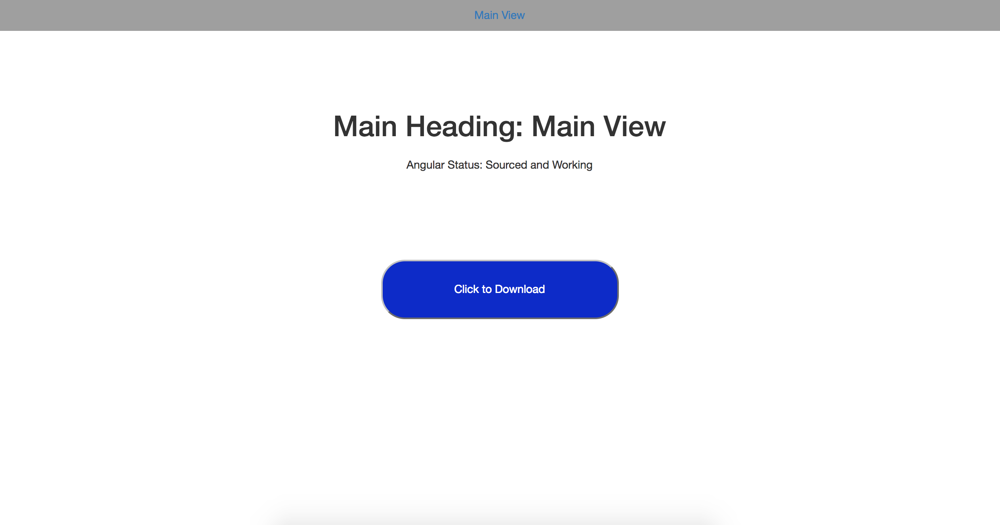

# Express-csv Download Template

---

## Description
#####  Very basic AngularJS app with a working object to csv download. This app does not require a server but requires a Localhost port.  When the download button is clicked, the browser downloads a hardcoded JSON object from server-side app.js file and onto the machines harddrive.  

  

---

## Technologies Used
  1. AngularJS
  2. Angular-Route
  3. bootstrap
  4. express
  5. express-csv
  6. GIT / GitHub

---  

## How To Install App
  1. Download zip file
  2. Open terminal and navigate into folder
  3. Run commands:
    - ``` npm install ``` Installs Node Packages
    - ``` npm test ``` Starts server using Nodemon
  5. App runs on Localhost: 5000

  ---

  ## License
  ##### Copyright 2017 Chris Stanton

  ###### Permission is hereby granted, free of charge, to any person obtaining a copy of this software and associated documentation files (the "Software"), to deal in the Software without restriction, including without limitation the rights to use, copy, modify, merge, publish, distribute, sublicense, and/or sell copies of the Software, and to permit persons to whom the Software is furnished to do so, subject to the following conditions:

  ###### The above copyright notice and this permission notice shall be included in all copies or substantial portions of the Software.

  ###### THE SOFTWARE IS PROVIDED "AS IS", WITHOUT WARRANTY OF ANY KIND, EXPRESS OR IMPLIED, INCLUDING BUT NOT LIMITED TO THE WARRANTIES OF MERCHANTABILITY, FITNESS FOR A PARTICULAR PURPOSE AND NONINFRINGEMENT. IN NO EVENT SHALL THE AUTHORS OR COPYRIGHT HOLDERS BE LIABLE FOR ANY CLAIM, DAMAGES OR OTHER LIABILITY, WHETHER IN AN ACTION OF CONTRACT, TORT OR OTHERWISE, ARISING FROM, OUT OF OR IN CONNECTION WITH THE SOFTWARE OR THE USE OR OTHER DEALINGS IN THE SOFTWARE.
